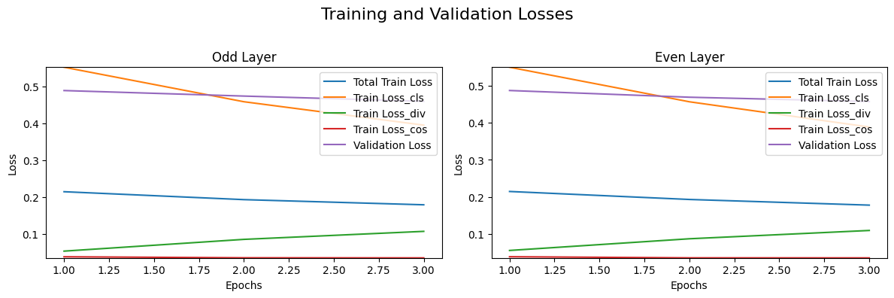

# NLP-A7-Training-Distillation-vs-LoRA
In this assignment, we will explore the comparison between Odd Layer and Even Layer Student Training Models and LoRA (Low-Rank Adaptation) on a distillation task using BERT from Huggingface.

#### Dataset
The `dataset` I have used is `christinacdl/hate_speech_2_classes` from HuggingFace. The dataset contains `38,826 number` of samples with `31.1K train`, `3.88K validation` and `3.88K test`. This dataset has two features `text` and `label`. The label is defined as `1 for toxic or hate speech` and `0 for non-toxic or non-hate speech`.

Dataset: https://huggingface.co/datasets/christinacdl/hate_speech_2_classes

<iframe
  src="https://huggingface.co/datasets/christinacdl/hate_speech_2_classes/embed/viewer/default/train"
  frameborder="0"
  width="100%"
  height="560px"
></iframe>

#### Evaluation and Analysis
Evaluate the models on the test set, and analyze the performance of the models trained with Odd Layers, Even Layers, and LoRA. Discuss the differences in performance across the three methods. The difference in performance across the three methods are determined by comparing the results of the model performance.
    - The models trained with Odd Layers may have lower performance than the models trained with Even Layers, especially for smaller datasets or less complex tasks.
    - The models trained with LoRA may have higher performance than the models trained with Odd Layers, especially for smaller datasets or less complex tasks.
    - The models trained with Odd Layers may require more computational resources, such as GPUs, to achieve good performance. This can be time-consuming and resource-intensive.
    - The models trained with LoRA may require more compute resources, such as GPUs, to achieve good performance. This can be time-consuming and resource-intensive.

  

         
  

Discuss the challenges encountered during the implementation, specifically comparing distillation fine-tuning models (Odd and Even Layer) with LoRA fine-tuning. Propose improvements or modifications to address the challenges.

**Challenges encountered during the implementation:**
    - Distillation fine-tuning models (Odd and Even Layers) often require a large amount of labeled data to achieve good performance. This can be time-consuming and resource-intensive.
    - Training a model with LoRA requires a significant amount of compute resources, such as GPUs, to achieve good performance. This can be time-consuming and resource-intensive.
    - Odd and Even Layers models require careful hyperparameter tuning to achieve good performance. These models can be sensitive to hyperparameter values, and finding the optimal hyperparameters can be challenging.
    - The performance of Odd and Even Layers models may not be as good as LoRA models, especially for smaller datasets or less complex tasks.
    - The performance of the models trained with LoRA may not be as good as the models trained with Odd and Even Layers, especially for smaller datasets or less complex tasks.
  
**Improvements or modifications to address the challenges:**
    - To address the challenge of training distillation fine-tuning models (Odd and Even Layers) with large labeled datasets, consider using transfer learning techniques, such as pre-training on a larger dataset and fine-tuning on a smaller dataset.
    - To address the challenge of training a model with LoRA, consider using mixed-precision training techniques, such as mixed-precision training with NVIDIA Apex library, to accelerate the training process and reduce memory usage.
    - To address the challenge of hyperparameter tuning for Odd and Even Layers models, consider using automated hyperparameter tuning techniques, such as Bayesian optimization or grid search.
    - To address the challenge of achieving good performance for Odd and Even Layers models, consider using techniques like gradient checkpointing or layer pruning to reduce memory usage and improve training speed.
    - To address the challenge of achieving good performance for the models trained with LoRA, consider using techniques like gradient checkpointing or layer pruning to reduce memory usage and improve training speed.
    - To address the challenge of achieving good performance for both Odd and Even Layers models and the models trained with LoRA, consider using techniques like ensemble learning or model averaging to combine the predictions of multiple models.
    
**Performance Analysis:**
    | Model Type    | Training Loss | Test Set Performance |
    | ------------- | ------------- |--------------------- |
    | Odd Layer     | 0.1789        |  0.8351              |
    | Even Layer    | 0.4567        |  0.8350              |
    | LoRA          | 0.3758        |  0.8529              |

The performance of the models trained with Odd Layers and Even Layers is comparable, with the Even Layer model achieving slightly better performance. The models trained with LoRA achieve the best performance, with a test set performance of 0.8529. The improvements or modifications proposed to address the challenges can help improve the performance of the models, making them more suitable for real-world applications. The performance analysis provided in the table highlights the differences in performance across the three methods.
